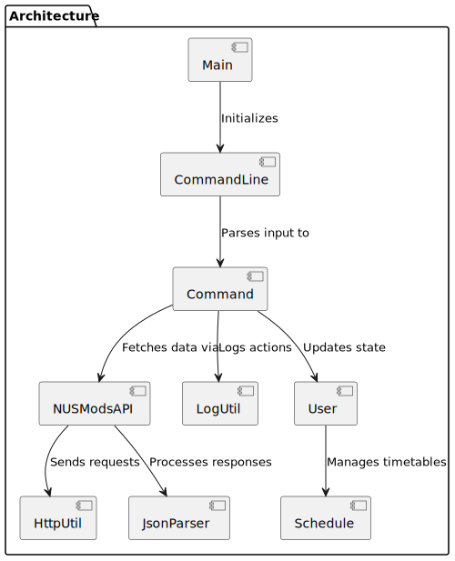
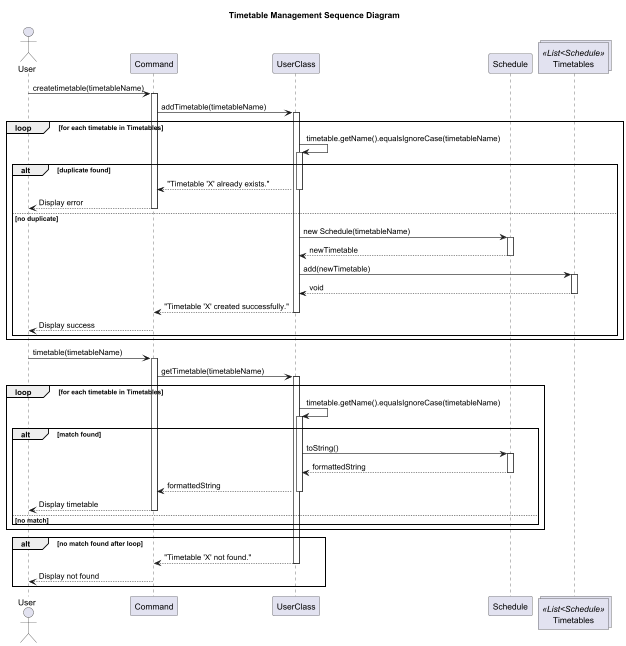
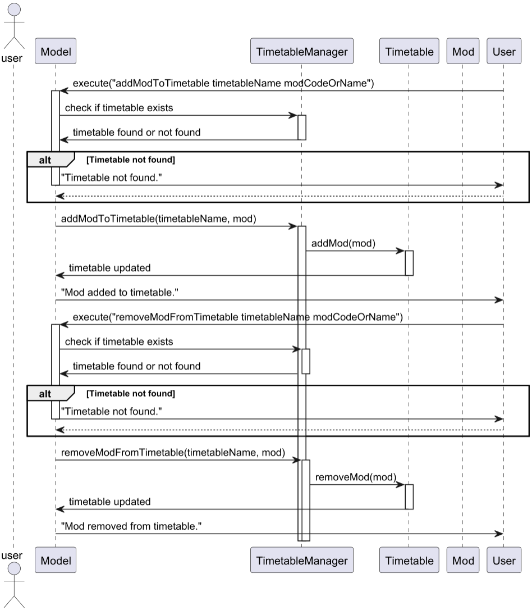
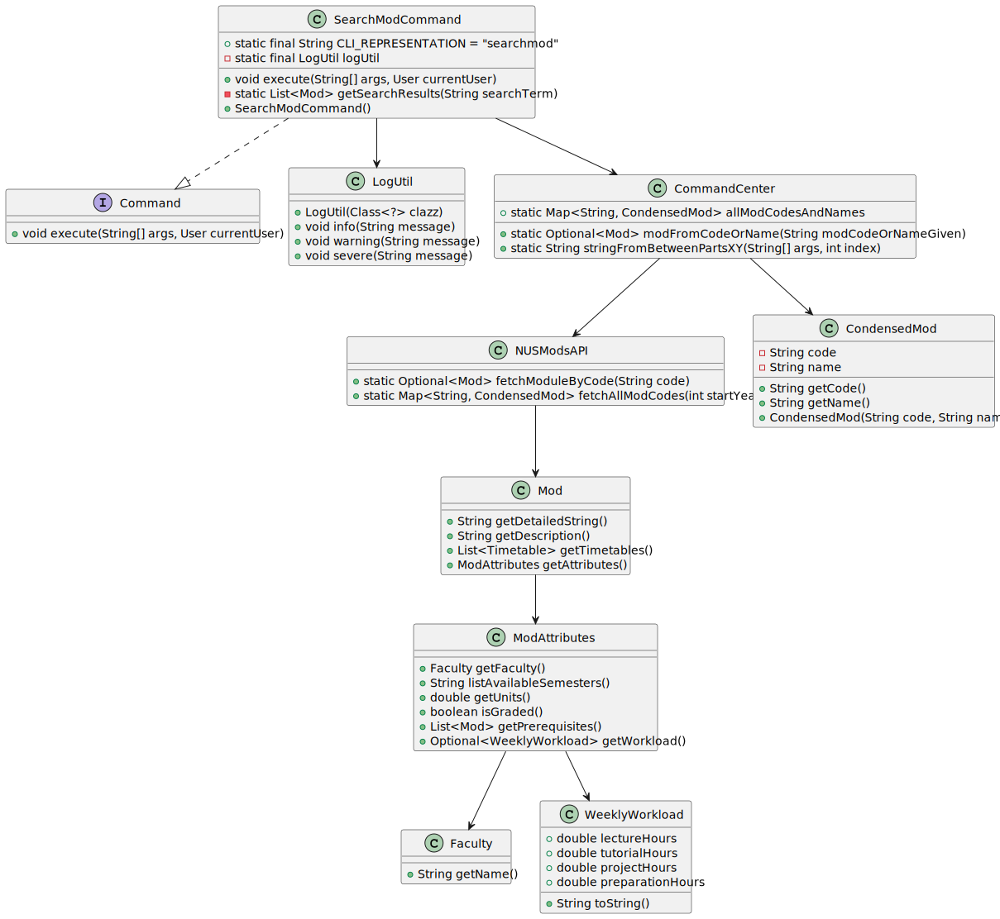
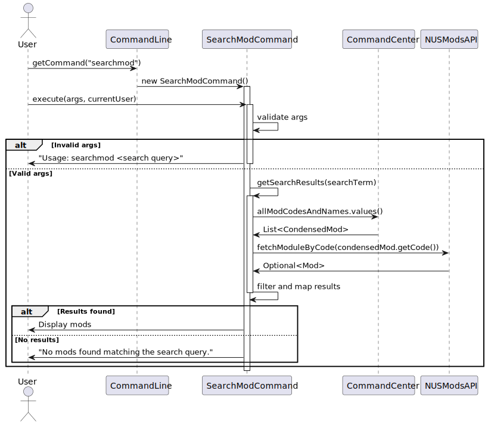

# Developer Guide
{: .no_toc }



## Table of Contents
{: .no_toc .text-delta }

1. TOC
{:toc}

## Acknowledgements

* The application integrates with the [NUSMods API](https://nusmods.com/) to fetch module data. Special thanks to the NUSMods team for providing their publicly available API.
* Command parsing logic is inspired by [AddressBook-Level3](https://github.com/se-edu/addressbook-level3).
* UML diagrams were created using [PlantUML](https://plantuml.com/).

## Glossary

* **Module** - A course or subject offered by the university.
* **Timetable** - A schedule of modules organized by semester.
* **CLI** - Command Line Interface, a text-based user interface.

## Setting up in IntelliJ

Prerequisites: JDK 17 (use the exact version), update IntelliJ to the most recent version.

1. **Ensure IntelliJ JDK 17 is defined as an SDK**, as described [here](https://www.jetbrains.com/help/idea/sdk.html#set-up-jdk) -- this step is not needed if you have used JDK 17 in a previous IntelliJ project.
2. **Import the project _as a Gradle project_**, as described [here](https://se-education.org/guides/tutorials/intellijImportGradleProject.html).
3. **Verify the setup**: After the importing is complete, locate the `src/main/java/modmate/Main.java` file, right-click it, and choose `Run Main.main()`. If the setup is correct, you should see something like the below:
   ```
   > Task :compileJava
   > Task :processResources NO-SOURCE
   > Task :classes

   > Task :Main.main()
   ```

{: .warning }
Keep the `src\main\java` folder as the root folder for Java files (i.e., don't rename those folders or move Java files to another folder outside of this folder path), as this is the default location some tools (e.g., Gradle) expect to find Java files.

## Design

### Architecture



The ***Architecture Diagram*** above provides a high-level overview of the system. It shows the main components of the application and how they interact with each other.

**Main components of the architecture:**
1. `Main`: Handles application startup and shutdown. It initializes and connects the other components.
2. `Command`: Encapsulates user actions such as adding modules, searching for modules, or viewing timetables.
3. `CommandLine`: Parses user input and maps it to specific commands.
7. `LogUtil`: Provides centralized logging functionality for debugging and tracking application behavior.

### How Components Interact

1. **User Input**: The user enters a command via the CLI.
2. **Command Parsing**: The `CommandLine` component parses the input and creates the appropriate `Command` object.
3. **Command Execution**: The `Command` interacts with other components to perform the requested operation.
4. **API Interaction**: If module data is required, the `Command` invokes `NUSModsAPI`, which uses `HttpUtil` to fetch data from the NUSMods API and processes it using `JsonParser`.
5. **Data Update**: The application's state is updated based on the command's execution.
6. **Output Display**: The results of the operation are displayed to the user.

This design ensures a clear separation of concerns, making the application modular and easier to maintain.

## Implementation

### View Module Details Feature

#### Proposed Implementation
{: .no_toc }

The viewMod feature allows users to retrieve and display details about a module by providing its code or name. This functionality relies on fetching module data from an external API and handling cases where the requested module is not found.
The feature is implemented in the viewMod function, which operates as follows:
- It asserts that the input is neither null nor empty.
- It attempts to retrieve the module using modFromCodeOrName.
- If a match is found, it displays the detailed module information and logs the action.
- If no match is found, it informs the user and logs the failure.

This feature involves the following key operations:
- `viewMod(inputCodeOrName)`: Main entry point for viewing module details.
- `modFromCodeOrName(modCodeOrNameGiven)`: Attempts to find a module based on the provided code or name.
- `fetchModuleByCode(moduleCode)`: Fetches module details from the NUSMods API.

#### Example Usage Scenario
{: .no_toc }

1\. The user enters a module code or name. The viewMod function is triggered, and the system logs the request.

2\. The system checks for a module matching the provided input using modFromCodeOrName. If found, it retrieves full details from fetchModuleByCode.

3a. If a module is found, its details are displayed, and a log entry is saved.

3b. If no module is found, an error message is displayed, and the failure is logged.


#### Design Considerations
{: .no_toc }

1. Data Retrieval Method
    - Alternative 1 (Current Choice): Fetch from External API Each Time
        - Pros: Ensures the latest module details are always retrieved.
        - Cons: API calls may introduce latency.
    - Alternative 2: Cache Module Data Locally
        - Pros: Reduces API calls, improving performance.
        - Cons: Data may become outdated without a refresh mechanism.

2. Error Handling
    - Alternative 1 (Current Choice): Log Errors and Return Empty Result
        - Pros: Ensures errors are recorded for debugging.
        - Cons: Users do not receive detailed error messages.
    - Alternative 2: Provide User-Friendly Error Messages
        - Pros: Helps users understand failures.
        - Cons: Adds complexity in differentiating error types.

#### Summary
{: .no_toc }

The viewMod feature provides a simple way to retrieve and display module details based on user input. It ensures robustness by handling errors and logging events while maintaining a straightforward implementation that prioritizes real-time data retrieval. Future improvements may include caching for performance optimization and enhanced error messaging.

### Timetable Management Feature

#### Purpose
{: .no_toc }

Allows users to create, update, and view multiple academic schedules.

#### Implementation
{: .no_toc }

Two core methods in the `User` class:

- `addTimetable(String timetableName)` - Method to add a new timetable for the user.
- `getTimetable(String timetableName)` - Method to display the user's timetables (mods included in the timetable).

These methods are supported by `Schedule` class for storage structure:

- `addTimetable(String timetableName)` first checks whether there are any duplicate timetables with the same name.

    It checks through a list called `List<Schedule> timetables` and if duplicate timetable found, an error message, "Timetable 'X' already exists", will be displayed.

    If no duplicate timetable found, a new Schedule object is instantiated and a new timetable of `timetableName` will be created. It is added to `timetables` list, after which a success message, "Timetable 'X' created successfully", is displayed.

- `getTimetable(String timetableName)` searches through a list called `timetables`, as mentioned earlier.

    If timetable with corresponding `timetableName` is found, a formatted String is returned which shows, the timetable name, all added modules and module details.

    If timetable is not found, an error message, "Timetable 'X' not found", will be displayed.

#### Design Rationale
{: .no_toc }

- Usage of `List<Schedule>` allowed for maintainable insertion order of timetables and straightforward iteration.
- Moreover, with the timetable duplication checking it allows for unnecessary object creation and potential naming conflicts.

#### Possible Extensions: Merging of multiple timetables
{: .no_toc }

- The following UML Sequence diagram effectively shows how these two methods are implemented with the inclusion of user inputs of `createtimetable` and `timetable` for `addTimetable(String timetableName)` and `getTimetable(String timetableName)` respectively.



### Adding/Removing a mod to a timetable
- Adds/Removes a new module (`Mod`) to a specified timetable.

**Format**: `addModToTimetable TIMETABLE_NAME MOD_CODE_OR_NAME`
            `removeModFromTimetable TIMETABLE_NAME MOD_CODE_OR_NAME`

- The `TIMETABLE_NAME` is the name of the timetable to which the module is being added.
- The `MOD_CODE_OR_NAME` is the code or name of the module to add/remove.
- The operation checks for the timetable and module's existence, adds/removes the module to the timetable, and saves the updated state.

**Example Usage**:

`addModToTimetable "Fall 2025 Schedule" "CS1010"`

This will add the module `CS1010` to the timetable **"Fall 2025 Schedule"**.

---

#### Design Explanation
{: .no_toc }

- **`addModToTimetable`**:
    - Loops through the `timetables` list to find a timetable by name (case-insensitive).
    - Calls `addMod` on the found timetable to add the `Mod` object.
    - If no timetable is found, an error message is printed.

- **`removeModFromTimetable`**:
    - Functions similarly to `addModToTimetable`, but calls `removeMod` instead of `addMod` on the timetable.

#### Alternatives Considered
{: .no_toc }

- **Optimization with a Map**:
    - Instead of searching through the entire list of `Timetable` objects every time, we could use a `Map<String, Timetable>`, where the key is the timetable name. This would speed up lookups to O(1) time complexity, providing faster access when managing timetables.


- **Error Handling**:
    - **Current Approach**: Instead of just printing an error, we could throw a custom exception (e.g., `TimetableNotFoundException`) when a timetable is not found. This would formalize error handling and make it easier to manage error propagation through the system.
    - **Pros**: Clear and formal error management, making it easier to debug and handle specific cases.
    - **Cons**: Adds complexity, especially if the exception handling needs to be propagated or caught higher in the stack.

#### Sequence Diagram
{: .no_toc }



### Schedule Management within Timetables
- **Purpose**: Allows users to select their preferred modules, based on accurate data provided by NUSMods
- **Implementation**: The `Schedule` class provides methods to add, remove, and view modules. The class is built on
top of the `Timetable` class, which is the internal format NUSMods stores its timetable data in. Each class session is
represented as a `Lesson` object; one of which contains the type (lecture, tutorial, lab, etc.), its period (day & time),
and the class venue.
  - Furthermore, in conjunction with `ScheduleMod`, users can select the lecture, tutorial, and lab
slots they would attend, to allow for more granular selection and modification of the timetables.
- **Rationale**: Encapsulating timetable logic in a dedicated class improves maintainability and testability.

The class diagram that represents the overview of the Schedule class is shown below:


### Search Module Feature

#### Proposed Implementation
{: .no_toc }



- The `searchmod` feature allows users to search for modules by providing a query string. This functionality is implemented in the `SearchModCommand` class and relies on matching the query against module codes and names. The feature ensures that relevant modules are retrieved and displayed in a user-friendly format.

The feature operates as follows:
- It validates that the input query is neither null nor empty.
- It searches for modules using the `getSearchResults` method, which matches the query against module codes and names.
- If matches are found, the results are displayed in order of relevance.
- If no matches are found, an appropriate message is displayed.

This feature involves the following key operations:
- `execute(String[] args, User currentUser)`: Main entry point for executing the search command.
- `getSearchResults(String searchTerm)`: Searches for modules matching the query and retrieves their details.

#### Sequence Diagram
{: .no_toc }



#### Example Usage Scenario
{: .no_toc }

1\. The user enters a search query (e.g., `searchmod CS2113`). The `SearchModCommand` is triggered, and the system logs the search request.

2\. The system uses the `getSearchResults` method to find modules whose codes or names match the query.

3a. If matching modules are found, their details are displayed to the user, and the action is logged.

3b. If no matches are found, a message is displayed to inform the user, and the failure is logged.

#### Design Considerations
{: .no_toc }

1. Search Algorithm:
    - Alternative 1 (Current Choice): Case-Insensitive Substring Matching
        - Pros: Simple to implement and intuitive for users.
        - Cons: May return irrelevant results for very short queries.
    - Alternative 2: Full-Text Search with Ranking
        - Pros: Provides more accurate and relevant results.
        - Cons: Requires additional complexity and computational resources.

2. Error Handling:
    - Alternative 1 (Current Choice): Display "No mods found" Message
        - Pros: Provides clear feedback to the user.
        - Cons: Does not suggest alternative queries or corrections.
    - Alternative 2: Suggest Closest Matches
        - Pros: Helps users refine their search queries.
        - Cons: Adds complexity to the implementation.

#### Summary
{: .no_toc }

The `searchmod` feature provides a straightforward way for users to search for modules by code or name. It ensures usability by handling errors gracefully and displaying relevant results. Future enhancements could include advanced search algorithms and suggestions for improving user queries.

## Product Scope

### Target User Profile

* NUS students who need a tool to manage their academic modules and timetables.
* Users comfortable with Command Line Interfaces (CLI).

### Value Proposition

* Provides a lightweight and efficient way for NUS students to plan and manage their academic schedules and module information, tailored to the unique requirements of the NUS modular system.

## User Stories

| Priority | As a …​          | I want to …​                     | So that I can …​                          |
| -------- | ---------------- | -------------------------------- | ----------------------------------------- |
| `* * * *`  | new user         | see usage instructions           | refer to them when I forget how to use the application |
| `* * * *`  | student          | search for a module by name or code | quickly find information about a specific module |
| `* * *`  | student          | view course details              | understand the specifics of a module      |
| `* * *`    | student          | create a timetable               | organize my academic schedule             |
| `* * *`    | student          | add a module to my timetable     | keep track of my academic schedule        |
| `* * *`    | student          | remove a module from my timetable | adjust my schedule as needed              |
| `* * *`    | student          | view all modules in my timetable | get an overview of my academic workload   |
| `* *`    | advanced user          | bookmark a course                | easily access my favorite or important modules |
| `* *`    | advanced user          | get bookmarked courses           | quickly view my saved modules             |
| `*`      | advanced user    | export my timetable to a file    | share it with others or back it up        |


## Non-Functional Requirements

1. The application should work on any mainstream OS with Java 17 installed.
2. The application should log all user actions and errors to a file for debugging purposes.

## Appendix: Instructions for Manual Testing

### Testing Commands

These instructions are tailored to the application's structure and functionality, ensuring comprehensive manual testing:

1. **Launching the Application**:
    - Run the `Main` class located in `src/main/java/modmate/Main.java`.
    - Verify that the application starts without errors and displays the welcome message.

2. **Timetable Creation**:
    - Test the `createtimetable` command (e.g., `createtimetable Semester1`) to generate a new timetable.
    - Verify that the timetable is initialized correctly and does not overwrite existing data unless explicitly confirmed.

3. **Adding Modules**:
    - Enter a valid `addmod` command (e.g., `addmod CS2113`) and verify that the module is added to the in-memory timetable.
    - Test edge cases such as adding duplicate modules or invalid module codes (e.g., `addmod XYZ123`) and confirm appropriate error messages are displayed.

4. **Viewing Timetable**:
    - Use the `timetable` command (e.g., `timetable Semester1`) to display all added modules.
    - Verify that the output matches the expected timetable, including module codes, names, and semesters.

5. **Removing Modules**:
    - Enter a valid `removemod` command (e.g., `removemod CS2113`) and ensure the module is removed from the in-memory timetable.
    - Test edge cases such as removing non-existent modules and verify the application handles them gracefully.

6. **Searching Modules**:
    - Test the `searchmod` command with valid module codes or names (e.g., `searchmod CS2113` or `searchmod Software`).
    - Verify that the search results are accurate and displayed correctly.
    - Test invalid or partial inputs and confirm that the application provides meaningful feedback.

7. **Bookmarking Modules**:
    - Use the `bookmark` command to mark a module as a favorite (e.g., `bookmark CS2113`).
    - Verify that the bookmarked module is displayed in a bookmarks list when using the `bookmarks` command.
    - Test edge cases such as bookmarking non-existent modules.


### Error Handling

1. Enter invalid commands (e.g., `add123`) and confirm that the application displays appropriate error messages.

2. Test edge cases:
    - Empty input: Press Enter without typing any command.
    - Invalid module codes: Use non-existent or malformed module codes (e.g., `addmod XYZ123`).
    - Excessively long inputs: Enter commands with overly long descriptions and verify the application handles them gracefully.

### API Integration

Ensure the application can fetch module data from the NUSMods API:

1. Disconnect from the internet and attempt to fetch data to verify error handling.
2. Reconnect and confirm that valid data is retrieved and displayed correctly.
3. Test commands that rely on API data (e.g., `search` or `add`) to ensure they function as expected.

### Performance Testing

1. Populate the in-memory timetable with a large number of modules (e.g., 1000 entries) and verify that the application remains responsive.
2. Measure the response time for commands such as `add`, `view`, and `search` to ensure they do not exceed 1 second.

### Logging

Check the log file generated by the application:

1. Confirm that all user actions and errors are logged.
2. Verify that log entries are clear and provide sufficient detail for debugging.
3. Test scenarios that generate warnings or errors (e.g., invalid commands, API failures) and ensure they are logged appropriately.

### Advanced Scenarios

1. **Concurrent Modifications**: Simulate concurrent user actions (e.g., adding and removing modules in quick succession) and verify that the application handles them correctly.

2. **Stress Testing**: Continuously add and remove modules in rapid succession to test the application's stability.

3. **Cross-Component Interactions**: Test commands that involve multiple components (e.g., adding a module and immediately bookmarking it) to ensure seamless integration.
